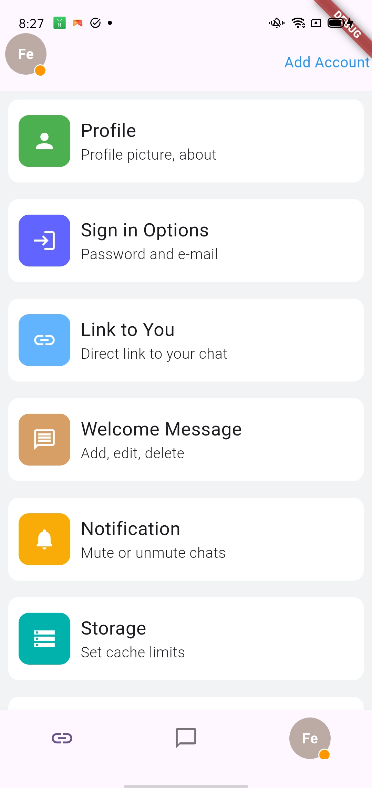

## Flutter Settings Screen
This project is a simple Flutter application showcasing a Settings Screen with a bottom navigation bar, dynamic profile status, and a list of settings items. The app utilizes the flutter_bloc package for state management and displays a range of settings options.

* Features
Bottom Navigation Bar: Allows easy access to different sections of the app.

* Profile Section: Displays the user's profile icon and dynamic status (e.g., 'Online', 'Away').

* Settings Items: Displays various settings options such as Profile, Notifications, and Storage.

* Dropdown with Cubit: Provides the ability to change the user's online status using a popup menu.

* Custom Widgets: Includes ItemCard and ProfileWidgets to display settings and user profile details.

## Dependencies
The following dependencies are used in the project:

* flutter_bloc: Used for managing state with the BLoC pattern.

* material.dart: Standard Flutter material widgets.

## Installation
* Clone the repository:

* git clone <https://github.com/nakhulkrishna/top-terms-task-projets>
Navigate to the project directory:

* cd <project_directory>
* Install dependencies:
* flutter pub get
* Run the app:

* flutter run Project Structure lib/

* constant/colors.dart: Contains color constants used  throughout the app.

 ## logic/dropdown.dart: Contains logic for managing the dropdown menu and changing the user's online status.

Screenshots
## Screenshots

## Demo

[🎥 Watch Video](assets/Record_2025-05-13-20-17-46.mp4)